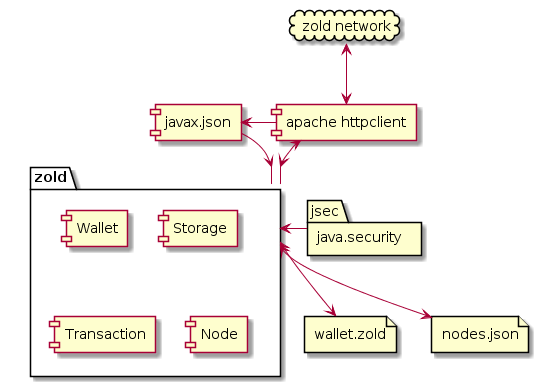

[](https://www.0crat.com/contrib/CAZUREFND)

[](http://www.elegantobjects.org)
[](https://www.0crat.com/p/CAZUREFND)
[](http://www.rultor.com/p/zold-io/java-api)
[](https://www.jetbrains.com/idea/)

[](https://travis-ci.org/zold-io/java-api)
[](http://www.javadoc.io/doc/io.zold/java-api)
[](http://www.0pdd.com/p?name=zold-io/java-api)
[](https://maven-badges.herokuapp.com/maven-central/io.zold/java-api)
[](https://github.com/zold-io/java-api/blob/master/LICENSE.txt)

[](https://codecov.io/github/zold-io/java-api?branch=master)
[](https://sonarcloud.io/dashboard?id=io.zold%3java-api)

Java API for Zold. Ruby API is in [zold-io/zold](https://github.com/zold-io/zold).

All you need is this:

```xml
<dependency>
  <groupId>io.zold</groupId>
  <artifactId>java-api</artifactId>
  <version><!-- Get it here: https://github.com/zold-io/java-api/releases --></version>
</dependency>
```

Java version required: 1.8+.

First, you find a wallet in a directory of wallets:

```java
Wallets wallets = new WalletsInDir(new File("/tmp/wallets"));
Wallet wallet = wallets.find("9999888877776666");
```

Then, you pull it:

```java
wallet.pull();
```

Then, you check its balance:

```java
Amount balance = wallet.balance();
assert balance.equals(new Amount(50.0d));
```

Then, you make a payment:

```java
String key = "jfUJklaljsios....JKLJLSksjd89os"; // private RSA key
String invoice = "JhYPOKNj@bbbbccccddddeeee";
Amount amount = new Amount(19.99d);
String details = "Thank you for the services!"
int txn = wallet.pay(key, invoice, amount, details);
```

Finally, you push it:

```java
wallet.push();
```

That's it.

## How to contribute?

Just fork the repo and send us a pull request.

Make sure your branch builds without any warnings/issues:

```
mvn clean install -Pqulice
```

## License (MIT)

Copyright (c) 2018 Yegor Bugayenko

Permission is hereby granted, free of charge, to any person obtaining a copy
of this software and associated documentation files (the "Software"), to deal
in the Software without restriction, including without limitation the rights
to use, copy, modify, merge, publish, distribute, sublicense, and/or sell
copies of the Software, and to permit persons to whom the Software is
furnished to do so, subject to the following conditions:

The above copyright notice and this permission notice shall be included
in all copies or substantial portions of the Software.

THE SOFTWARE IS PROVIDED "AS IS", WITHOUT WARRANTY OF ANY KIND, EXPRESS OR
IMPLIED, INCLUDING BUT NOT LIMITED TO THE WARRANTIES OF MERCHANTABILITY,
FITNESS FOR A PARTICULAR PURPOSE AND NON-INFRINGEMENT. IN NO EVENT SHALL THE
AUTHORS OR COPYRIGHT HOLDERS BE LIABLE FOR ANY CLAIM, DAMAGES OR OTHER
LIABILITY, WHETHER IN AN ACTION OF CONTRACT, TORT OR OTHERWISE, ARISING FROM,
OUT OF OR IN CONNECTION WITH THE SOFTWARE OR THE USE OR OTHER DEALINGS IN THE
SOFTWARE.

## Requirements

These are the requirements for this API.

**Note:** The original whitepaper on *zold* can be found [here](https://www.zold.io/). The whitepaper and the documentation found at www.zold.io serve as the highest authority on the subject of *zold*. The following requirements are condensed versions of the points expressed in the aforementioned docs as they relate to the scope of this project:

* Maintain a wallet in structured textual format, within which is a ledger that contains transactions for that wallet.
* Make payments:
  * Taxes according to fixed formula
  * Payments to other wallets
  * Sign with RSA key
  * Push to network
* Receive payments:
  * Pull the paying wallet from the network
  * Merge the copies of the paying wallet with our own copy
* We need to refresh our local database of network nodes by querying the network.
* We must implement with Java 8
* Non-functional requirements were not made, but we expect
  * Flawless concurrency
  * "Decent" performance
  * Designs must respect the principles of [elegant objects](www.elegantobjects.org)

## Decisions and Alternatives

* `javax-json` is a Java API that can parse and also write JSON. As part of the EE7 spec, it is stable, well established, and is the standard. We can use it to write to our local database file. Alternatives are google's [gson](https://github.com/google/gson), [JSON-java](https://github.com/stleary/JSON-java), [jackson-databind](https://github.com/FasterXML/jackson-databind/), and many others.
* The standard `java.security` package contains everything we need to import keystores and sign/encrypt messages with RSA keys. There are lots of examples on the internet on how to use it. I am not aware of any other popular alternative out there.
* Apache's [http client](https://hc.apache.org/httpcomponents-client-4.5.x/index.html) is a popular Java library for building HTTP requests and receiving their responses. Its design is not object-oriented, but it carries minimal dependencies and is production-ready. Alternatives are `jcabi-http` (lots of dependencies), `cactoos-http` (not yet ready for production), and many others.
* Our API will consist of our core classes that will communicate with the network using Apache HttpClient + javax.json, a local storage (`nodes.json`) for persistence of remote node data, will use the `java.security` package when signing the transactions, and will expect wallet files to have the `.zold` extension and conform to the format specified in the whitepaper:


